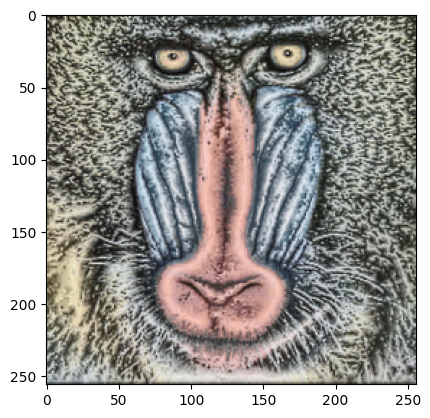

# Python library : torch_phasecong
The torch_phasecong library provides the 2D phase congruency algorithm using monogenic filters implemented in PyTorch and originally written by Peter Kovesi on Matlab.
<br />
<br />
<br />


# References :

- https://peterkovesi.com/projects/phasecongruency/index.html


<hr />

# Install library


```bash
%%bash
if !python -c "import torch_phasecong" 2>/dev/null; then
    pip install https://github.com/Simon-Bertrand/2DPhaseCongruency-PyTorch/archive/main.zip
fi
```

# Import library


```python
import torch_phasecong
```

# Load data


```python
!pip install -q torchvision requests matplotlib
import tempfile
import torchvision
import torch.nn.functional as F
import requests
import torch
with tempfile.NamedTemporaryFile() as fp:
    fp.write(requests.get("https://upload.wikimedia.org/wikipedia/commons/a/ab/Mandrill-k-means.png").content)
    im = F.interpolate((torchvision.io.read_image(fp.name, torchvision.io.ImageReadMode.RGB).unsqueeze(0)
    .to(torch.float64)
    .div(255)), size=(256, 256), mode='bicubic', align_corners=False)
```

    
    [notice] A new release of pip is available: 23.2.1 -> 24.0
    [notice] To update, run: pip install --upgrade pip


# Compute phase congruency


```python
phaseCong = torch_phasecong.phasecong(im[0,0])
```


```python
import matplotlib.pyplot as plt
plt.imshow(phaseCong[2], cmap="gray")
plt.imshow(im[0].moveaxis(0,-1), alpha=0.3)
```

    Clipping input data to the valid range for imshow with RGB data ([0..1] for floats or [0..255] for integers).


    <matplotlib.image.AxesImage at 0x7f4175026410>


    

    

